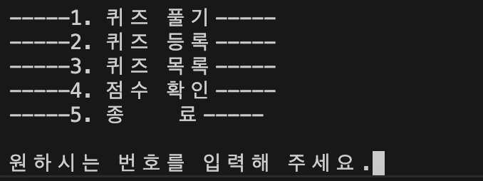
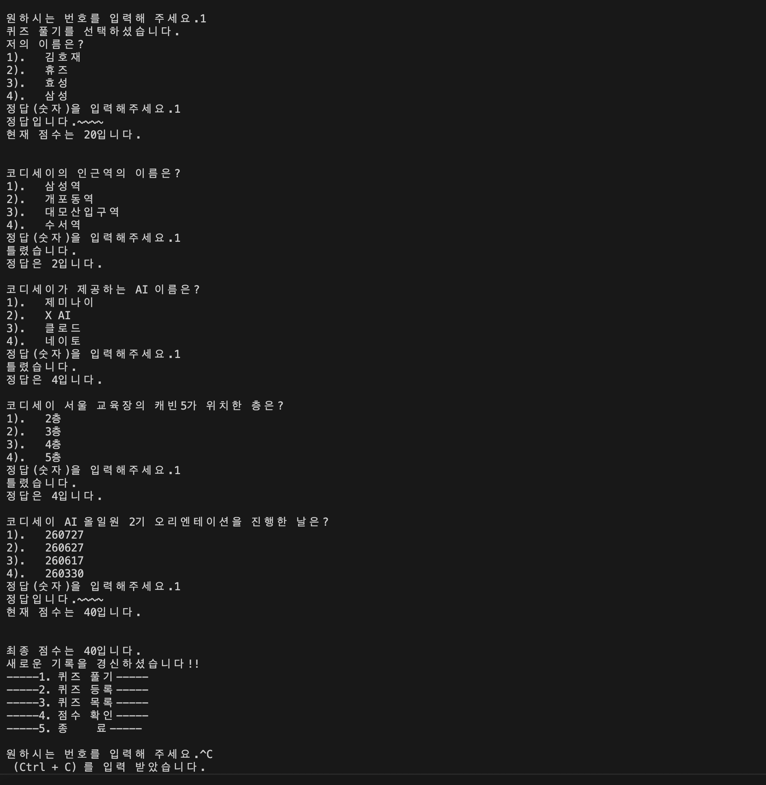
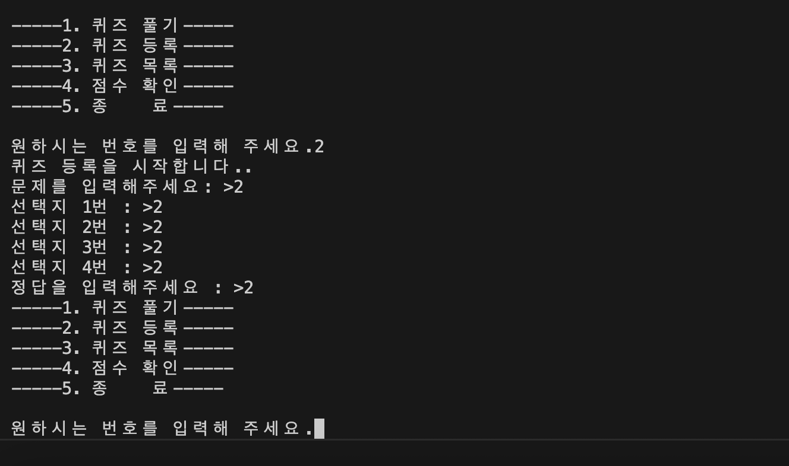
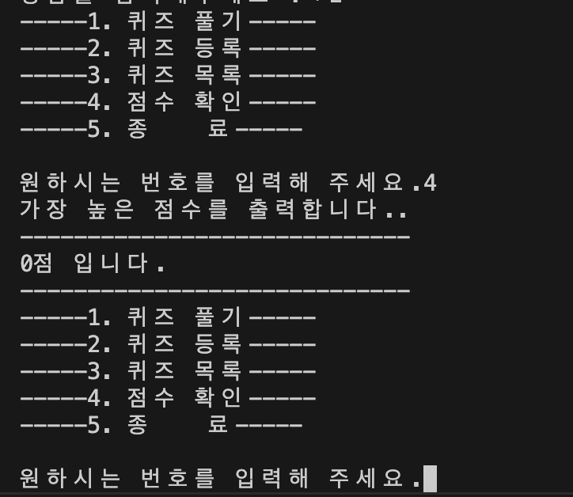

# 📝 나만의 퀴즈 게임 (Console Quiz Game)

## 1. 프로젝트 개요
터미널 환경에서 실행되는 파이썬 기반의 객체지향 퀴즈 게임입니다. 
사용자가 직접 퀴즈를 풀고, 새로운 문제를 추가하며, 최고 점수를 기록할 수 있습니다.
프로그램이 종료되어도 데이터가 유지되는 영속성을 구현했습니다.

## 2. 퀴즈 주제 선정 이유
*   **주제:** 코디세이
*   **선정 이유:** 쉬움
## 3. 실행 방법
프로그램을 실행하려면 아래 명령어를 터미널에 입력하세요.
~~~bash
python main.py
~~~

또는 vs code 오른쪽 위의 재생버튼을 클릭합니다.

> **Note:** Python 3.10 이상 환경에서 실행을 권장합니다. 외부 라이브러리 설치는 필요하지 않습니다. (match 키워드가 3.10이상 에서만 작동합니다.)

## 4. 기능 목록
*   **1. 퀴즈 풀기:** 무작위 순서로 출제되는 퀴즈를 풉니다. (정답 시 20점 추가)
*   **2. 퀴즈 등록:** 사용자가 직접 새로운 문제, 4개의 선택지, 정답 번호를 입력하여 추가합니다.
*   **3. 퀴즈 목록:** 현재 등록되어 있는 모든 퀴즈를 확인합니다.
*   **4. 점수 확인:** 역대 플레이 기록 중 가장 높았던 최고 점수를 확인합니다.
*   **5. 종료:** 안전하게 데이터를 저장하고 프로그램을 종료합니다.
*   **🛡️ 예외 처리 내장:** 잘못된 값(문자, 범위 이탈, 공백)이나 강제 종료(`Ctrl+C`, `Ctrl+D`) 시에도 프로그램이 뻗지 않고 대응합니다.

## 5. 파일 구조

- 📦 퀴즈 게임 프로젝트
  - 📜 `main.py` : 프로그램 진입점 (메뉴 루프 실행)
  - 📜 `quizgame.py` : 게임 전반의 로직과 상태를 통제하는 메인 보드 역할
  - 📜 `quiz.py` : 개별 문제의 상태(question, choices, answer) 정의
  - 📜 `data_handle.py` : JSON 파일 읽기/쓰기 모듈
  - 📜 `custom_input.py` : 사용자 입력 및 예외 검증 모듈
  - 📜 `state.json` : 영속성 데이터 저장 파일
  - 📂 `docs/`
    - 📂 `screenshots/` : 기능 실행 화면 캡처 이미지 모음
      - 📜 `.gitkeep` : 빈 폴더를 Git에 추적시키기 위한 파일
  - 📜 `README.md` : 프로젝트 설명서

## 6. 데이터 파일 설명 (state.json)
*   **경로:** 프로젝트 루트 디렉터리 (`/state.json`)
*   **역할:** 퀴즈 데이터와 최고 점수가 영구적으로 유지되도록 하는 저장소입니다.
*   **스키마:**

~~~json
{

  #퀴즈들을 넣음

    "quizzes": [
        {

          #질문 내용
            "question": "문제 내용 (str)",

          # 선택지
            "choices": ["선택지1", "선택지2", "선택지3", "선택지4"],

          # 정답
            "answer": 정답 번호 (int, 1~4)
        }
    ],

    # 최고 점수를 넣음
    "best_score": 최고 점수 (int)
}
~~~

## 7. 스크린샷 (실행 화면)
*   **메뉴 화면:** 
*   **퀴즈 풀기:** 
*   **퀴즈 추가:** 
*   **점수 확인:** 

## 8. Git 실습 증빙 (Clone & Pull)
과제 요구사항에 따른 저장소 복제 및 동기화 실습을 완료했습니다.

*   **Clone 및 Push:** 
    *   별도 로컬 디렉터리(`E01-02-cloned`)에 `git clone`으로 저장소를 복제했습니다.
    *   `main` 브랜치로 이동 후, 기존 테스트 파일을 삭제하고 `pull_test1.txt`를 새롭게 생성하여 원격 저장소에 `push`를 완료했습니다.
*   **Pull:** 
    *   기존 작업 디렉터리(`E01-02`)로 복귀하여 `git pull origin main`을 실행했습니다.
    *   원격 저장소의 변경 사항(Fast-forward 병합)이 기존 로컬 환경에 정상적으로 동기화된 것을 확인했습니다.

📄 **상세 내역 확인**
*   [터미널 실행 로그 원본 보기 (`docs/clone_pull.md`)](./docs/clone_pull.md)

## 9. 문제가 1000개로 확장될때 대처법
* **DB를 이용한다:** 
    * 개별 파일인 json파일에 저장하지 않고 table에 저장하면 json 전체를 가져올떄마다 필요한 시간과 공간이 절약될것이라고 봅니다. 
    * 원하는 개별 퀴즈를 가져오거나 저장할때도 필요한 데이터를 따라 빠르게 insert 하거나 update할 수 있습니다.
    * 인덱스를 추가한다면 검색하는데 시간을 줄일수 있기에 큰 도움이 될거라고 생각합니다.

## 10. 데이터 읽고 쓰는과정

*   **데이터를 읽는 방법:** 
    *   QuizGame에서 __init__하는 과정에서 data_handle.py에 있는 read_json_data()를 실행합니다.
    json.load()를 이용하여 state.json 파일을 읽습니다.
    그리고 딕셔너리로 반환합니다.
    받아온 json에서 가져온 데이터를 quizgame.data(dict 타입)으로 가져옴
    *   parsing : quizgame.unpack_data()를 실행합니다.
    
*   **ㄹㄹ:** 
    *   =
    *   =

📄 **상세 내역 확인**
*   [터미널 실행 로그 원본 보기 (`docs/clone_pull.md`)](./docs/clone_pull.md)

 -- 💡 개발 과정 및 배운 점 (Troubleshooting)
프로젝트를 진행하며 직면한 문제들과 이를 해결한 과정입니다.

* **Git Branch 생성 조건 파악:** 
  초기화 직후 메인 브랜치에 아무런 커밋 기록이 없으면 새로운 브랜치를 파생시킬 수 없다는 것을 확인했습니다. 최소 1회의 초기 커밋이 선행되어야 함을 배웠습니다.
* **빈 폴더 추적 관리:** 
  Git은 파일의 변경 사항만 추적하므로 빈 폴더(`docs/screenshots` 등)는 `git add .`로 추가되지 않습니다. 이를 해결하기 위해 폴더 내부에 `.gitkeep` 더미 파일을 생성하여 구조를 유지했습니다.
* **커밋 수정 및 브랜치 이동:** 
  이전 커밋에 변경 사항을 덮어씌울 때는 `git commit --amend`를 활용했고, `git switch -c <브랜치명>` 명령어로 브랜치 생성과 이동을 동시에 수행하며 작업 속도를 높였습니다. 현재 위치는 `git branch`로 수시로 확인했습니다.
* **데이터 동기화 문제 해결:** 
  퀴즈를 추가하거나 점수가 갱신될 때 메모리상의 `self.quiz_list`는 변경되지만, JSON으로 저장할 `self.data` 딕셔너리가 자동으로 업데이트되지는 않았습니다. 이는 객체의 상태 변화가 딕셔너리에 실시간으로 연동되지 않기 때문이며, 저장 직전에 메모리의 데이터를 딕셔너리로 다시 포장해주는(`self.updating_quiz()`) 동작이 필수적임을 깨달았습니다.